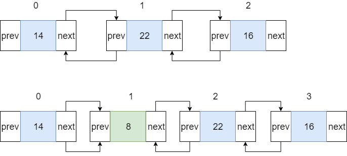
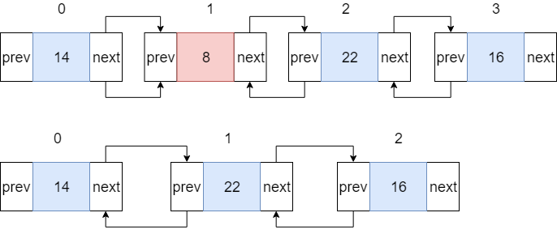

# java.util.LinkedList

## Введение

Класс `java.util.LinkedList` является второй, после `java.util.ArrayList`, популярной реализацией интерфейса `java.util.List`.

Данная реализация основана на двусвязном списке, каждый элемент содержит ссылку на следующий и предыдущий элементы.

Реализация полностю написана на `Java` и не использует никаких `native` методов.

> Ключевое слово `native` означает, что метод реализован в платформенно-зависимом коде, чаще всего на `C/C++`, и скомпонован в виде динамической библиотеки.
>
> Эта реализация зависит от `JVM`.

Позволяет хранить любые значения, в том числе и `null` значения.

## Реализация

Прежде всего обратим внимание на поля класса и выделим наиболее значимые:

```java
    transient int size = 0;

    /**
     * Pointer to first node.
     * Invariant: (first == null && last == null) ||
     *            (first.prev == null && first.item != null)
     */
    transient Node<E> first;

    /**
     * Pointer to last node.
     * Invariant: (first == null && last == null) ||
     *            (last.next == null && last.item != null)
     */
    transient Node<E> last;

    private static class Node<E> {
        E item;
        Node<E> next;
        Node<E> prev;

        Node(Node<E> prev, E element, Node<E> next) {
            this.item = element;
            this.next = next;
            this.prev = prev;
        }
    }
```

В классе `java.util.LinkedList` объявляется вложенный класс `Node`.

Класс `Node` является оберткой, в которую 'заворачиваются' все добавляемые элементы, он необходим для того, чтобы объявить ссылки на близлежащие элементы списка.

Представьте себе цепь, каждое звено которой сцеплено с предыдущим и следующим звеном. Так вот каждое звено - это и есть объект класса `Node`.

Проиллюстрируем это:


Количество элементов в списке хранится в переменной `size`, точно также как и в `java.util.ArrayList`.

Класс `java.util.LinkedList` хранит ссылку на первый и последний элемент списка. Благодрая чему осуществляется быстрая вставка в начало и в конец.

Теперь разберем то, как происходит добавление элементов в список.

## Добавление элемента

 В `java.util.LinkedList` существует несколько методов добавить элемент, для начала разберем наиболее часто используемый.

 За добавление элемента в конец у `java.util.LinkedList` отвечает метод:

```java
    /**
     * Appends the specified element to the end of this list.
     *
     * <p>This method is equivalent to {@link #addLast}.
     *
     * @param e element to be appended to this list
     * @return {@code true} (as specified by {@link Collection#add})
     */
    public boolean add(E e) {
        linkLast(e);
        return true;
    }

    /**
     * Links e as last element.
     */
    void linkLast(E e) {
        final Node<E> l = last;
        final Node<E> newNode = new Node<>(l, e, null);
        last = newNode;
        if (l == null)
            first = newNode;
        else
            l.next = newNode;
        size++;
        modCount++;
    }
```

Здесь все довольно прозрачно.

Создается объект-обертка `Node`, туда кладется добавляемый элемент и этот `Node` становится последним, при этом переопределяются ссылки `prev` и `next`.

Это выглядит точно также, как если бы к концу цепи добавили еще одно звено: сначала вы это звено создаете, а после скрепляете с конечным элементом.

После добавления возвращается значение `true`, так как список изменяется - все по контракту `Collection#add`.

Благодаря тому, что `java.util.LinkedList` хранит ссылку на последний элемент, добавление в конец происходит за константное время: `O(1)`.

Точно то же самое происходит при добавлении в начало списка.

А вот добавление в середину выглядит немного иначе.

### Добавление в середину

За добавление элемента в конкретную ячейку по индексу у `java.util.LinkedList` отвечает метод:

```java
    /**
     * Inserts the specified element at the specified position in this list.
     * Shifts the element currently at that position (if any) and any
     * subsequent elements to the right (adds one to their indices).
     *
     * @param index index at which the specified element is to be inserted
     * @param element element to be inserted
     * @throws IndexOutOfBoundsException {@inheritDoc}
     */
    public void add(int index, E element) {
        checkPositionIndex(index);

        if (index == size)
            linkLast(element);
        else
            linkBefore(element, node(index));
    }
```

Добавление происходит в несколько этапов:

1. Идет проверка на то, что индекс, по которому происходит вставка, не выходит за границы списка:

```java
    private void checkPositionIndex(int index) {
        if (!isPositionIndex(index))
            throw new IndexOutOfBoundsException(outOfBoundsMsg(index));
    }

    /**
     * Tells if the argument is the index of a valid position for an
     * iterator or an add operation.
     */
    private boolean isPositionIndex(int index) {
        return index >= 0 && index <= size;
    }
```

2. После этого идет проверка на то, что добавление идет в конец или вставка будет где-то в середине. Если вставка будет в конец, то вызыватеся знакомый уже метод `linkLast(element)`:

```java
    if (index == size)
        linkLast(element);
    else
        linkBefore(element, node(index));
```

1. Если вставка происходит в середину, то вызывается метод `node`, которому передается индекс элемента, перед которым будет вставляться добавляемый элемент:

```java
    /**
     * Returns the (non-null) Node at the specified element index.
     */
    Node<E> node(int index) {
        // assert isElementIndex(index);

        if (index < (size >> 1)) {
            Node<E> x = first;
            for (int i = 0; i < index; i++)
                x = x.next;
            return x;
        } else {
            Node<E> x = last;
            for (int i = size - 1; i > index; i--)
                x = x.prev;
            return x;
        }
    }
```

4. После того, как найден элемент, перед которым будет вставляен добавляемый элемент, вызывается `linkBefore`:

```java
    /**
     * Inserts element e before non-null Node succ.
     */
    void linkBefore(E e, Node<E> succ) {
        // assert succ != null;
        final Node<E> pred = succ.prev;
        final Node<E> newNode = new Node<>(pred, e, succ);
        succ.prev = newNode;
        if (pred == null)
            first = newNode;
        else
            pred.next = newNode;
        size++;
        modCount++;
    }
```

Чтобы проще понять то, что происходит снова представьте себе цепь. Вас просят вставить новое звено перед, например, 4-м звеном. 

Что вы будете делать? 

Сначала найдем место вставки, отсчитав от начала 4 звена, после чего сделаем новое звено и скрепим его в месте цепи, которое только что нашли.

Проиллюстрируем это:



> Зленеым отмечен вставляемый элемент.
>
> Начальный список содержит элементы 14, 22 и 16.

Из алгоритма ясно, что раз для нахождения места вставки приходится перебирать список, то вставка элемента `по индексу` будет происходить за линейное время: `O(N)`.

## Удаление элемента

Удаление элемента из `java.util.LinkedList` возможно двумя способами:

* `public E remove(int index)` - по индексу
* `public boolean remove(Object o)` - по значению

### Удаление по индексу

За удаление по индексу у `java.util.LinkedList` отвечает метод:

```java
    /**
     * Removes the element at the specified position in this list.  Shifts any
     * subsequent elements to the left (subtracts one from their indices).
     * Returns the element that was removed from the list.
     *
     * @param index the index of the element to be removed
     * @return the element previously at the specified position
     * @throws IndexOutOfBoundsException {@inheritDoc}
     */
    public E remove(int index) {
        checkElementIndex(index);
        return unlink(node(index));
    }

    /**
     * Unlinks non-null node x.
     */
    E unlink(Node<E> x) {
        // assert x != null;
        final E element = x.item;
        final Node<E> next = x.next;
        final Node<E> prev = x.prev;

        if (prev == null) {
            first = next;
        } else {
            prev.next = next;
            x.prev = null;
        }

        if (next == null) {
            last = prev;
        } else {
            next.prev = prev;
            x.next = null;
        }

        x.item = null;
        size--;
        modCount++;
        return element;
    }
```

В начале идет привычная проверка на то, не выходит ли индекс за рамки списка.

После этого находится удаляемый элемент с помощью уже знакомого метода `node`.

Далее, в зависимости от расположения элемента, идет 'разлинковка', т.е перебрасывание ссылок.

Проиллюстрируем это:



> Красным отмечен удаляемый элемент.
>
> Начальный список содержит элементы 14, 8, 22 и 16.

На рисунке из списка, содержащего значени 14, 8, 22 и 16 удаляется элемент по индексу 1, т.е 8-ка.

В начале этот элемент находится перебором от начала списка, после чего изменяется ссылка `next` для предыдущего элемента и `prev` для следующего у найденного для удаления.

У `java.util.LinkedList` удаление и вставка по логике работы очень похожи.

### Удаление по значению

Для удаления по значению у `java.util.LinkedList` отвечает метод:

```java
    /**
     * Removes the first occurrence of the specified element from this list,
     * if it is present.  If this list does not contain the element, it is
     * unchanged.  More formally, removes the element with the lowest index
     * {@code i} such that
     * <tt>(o==null&nbsp;?&nbsp;get(i)==null&nbsp;:&nbsp;o.equals(get(i)))</tt>
     * (if such an element exists).  Returns {@code true} if this list
     * contained the specified element (or equivalently, if this list
     * changed as a result of the call).
     *
     * @param o element to be removed from this list, if present
     * @return {@code true} if this list contained the specified element
     */
    public boolean remove(Object o) {
        if (o == null) {
            for (Node<E> x = first; x != null; x = x.next) {
                if (x.item == null) {
                    unlink(x);
                    return true;
                }
            }
        } else {
            for (Node<E> x = first; x != null; x = x.next) {
                if (o.equals(x.item)) {
                    unlink(x);
                    return true;
                }
            }
        }
        return false;
    }
```

Принцип работы абсолютно тот же самый, что и удаления `по индексу`, изменяется только способ нахождения элемента для удаления.

Список все также обходится начиная с начала, при этом каждый элемент сравнивается с помощью `equals`. 

При удалении по значению **очень** важно переопределенный метод `equals`, так как удаляемый элемент ищется с его помощью:

```java
o.equals(x.item)
```

[Подробнее про equals](../../object/equals.md).

Если же удаялется `null` значение поиск идет до первого попавшегося `null` в списке.

После того, как элемент найден, происходит стандартный `unlink`.

Если в списке присутствуют дубли, то удален будет **первый найденный** элемент!

## Многопоточность

Все методы `java.util.LinkedList` - не синхронизированы.

Поэтому добавление из различных потоков в такой список **строго** не рекомендуется.

## Производительность

Благодаря тому, что в основе реализации лежит двусвязный список, `java.util.LinkedList` предоставляет доступ к элементам `по индексу` и `по значению` за линейное время: `O(1)`.

Так как происходит перебор списка!

С другой стороны, благодрая переменным, хранящим начало и конец списка, добавление в начало и в конец происходит за константное время: `O(1)`.

Так как `java.util.LinkedList` 'оборачивает' добавляемые элементы в `Node`, то это накладывает дополнительные затраты на хранение списка в памяти.

## Заключение

Реализация `java.util.LinkedList` из стандартной библиотеки `Java` предоставляет линейное время доступа к элементам по значению и по индексу.

Однако предоставляет быструю вставку в конец или начало списка.

Данная реализация позволяет хранить любые значения, в том числе дубликаты и `null`.

Не синхронизована, поэтому доступ из разных потоков не рекомендуется.

Также, благодаря быстрому доступу до первого и последнего элемента в списке, `java.util.LinkedList` неплохо подходит для реализаций [FIFO](https://ru.wikipedia.org/wiki/FIFO) и [LIFO](https://ru.wikipedia.org/wiki/LIFO), т.е очередей и стэков.