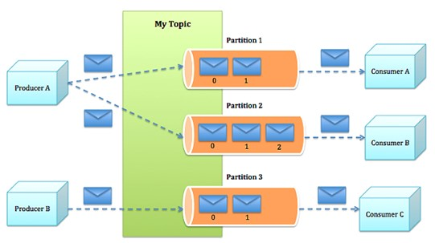

# Apache Kafka

## Введение

`Apache Kafka` — это так называемая `Distributed Streaming Platform`, распределенная система передачи сообщений, рассчитанная на высокую пропускную способность.

1. Распределенность
    
    Распределенность `Apache Kafka` заключается в том, что хранение, получение и рассылка сообщений организована на разных узлах, которые в терминах `Apache Kafka` называются `брокеры`.

    Распределнность дает `Apache Kafka` высокодоступность и отказоустойчивость.
    
2. Масштабируемость
    
    `Apache Kafka` горизонтально масштабируема.

    Кластер можно прозрачно расширять без простоя.
    
    Горизонтальная масштабируемость решает проблему увеличения производительности, путем подключения большего количества машин в кластер. При добавлении новой машины никаких простоев не происходит, при этом, количество машин, которые можно добавить в кластер, ничем не ограничен.

3. Отказоустойчивость

    Сообщения в кластере реплицированы.
    
    Для обеспечения отказоустойчивости обязательно приходится частично жертвовать производительностью, поскольку чем лучше ваша система переносит отказы, тем ниже ее производительность. 
    

Иногда еще говорят, что `Apache Kafka` - это распределенный журнал логов.

В таком определении лог - это не то, что вы привыкли видеть как отчет вашей системы о работе.
Это очередь данных, которая отсортирована по времени, и куда данные можно только **добавлять**.

## Основные понятия

В терминологии `Apache Kafka` кластер состоит из одного или нескольких серверов, называемых брокер сообщений или просто `broker`.

Тот, кто публикует сообщения называется `producer`, тот, кто забирает - `consumer`.

Публикация сообщений происходит в `topic`. Топик – это логическая сущность с собственным уникальным именем, физически для топика `Apache Kafka` выделяет собственное лог-пространство, которое разбивается на `partition`, партиции.

По сути `partition` - это упорядоченная очередь, в которую непрерывно добавляются сообщения. Каждому сообщению присваивается уникальный для партиции порядковый номер, идентифицирующий положение сообщения в партиции. Этот номер называется `offset`.

Понятно, что чем меньше `offset` - тем старше сообщение.

> Главное, что надо запомнить, так это то, что на самом деле сообщения хранятся в партициях, которые в свою очередь логически объединены в топик.

Каждый брокер отвечает за свой набор партиций, благодаря чему `producer`-ы и `consumer`-ы могут одновременно и публиковать, и читать сообщения.

При этом на то, в какую партицию попадет сообщение можно влиять, как будет расказано позже.

Идея `Apache Kafka` очень простая.

Есть большое количество сервисов, которые генерируют разные события и данные: логи, мониторинг и т.д. Они публикуют данные в топики.

Есть сервисы, которым эти данные очень нужны. Они забирают данные из топиков.

Данные, после того, как их забрали, никуда не деваются, а остаются на диске в течении некоторого заданного интервала времени.

Грубо говоря, это некоторый гибрид распределенной базой данных и очередью сообщений.

В общем виде схема взаимодействия выглядит так:

// todo 
## Архитектура

Из каких компонентов состоит `Apache Kafka`?

Как уже было сказано, `Apache Kafka` состоит из набора брокеров, где каждый брокер - это отдельная машина, а также `Apache Zookeeper`.

`Apache Zookeeper` отвечает за хранение метаинформации.

Является неотъемлемой частью кластера. Решает одну из основных проблем распределенных систем – определение, какой сервер активен в любой момент времени.

Помимо всего прочего, `Apache Zookeeper` используется для хранения инфомрации о конфигурации топиков и партиций, реплик, `ACL` и т.д.

Подробнее об этом [Зачем нужен Apache Zookeeper для Kafka](https://www.cloudkarafka.com/blog/2018-07-04-cloudkarafka_what_is_zookeeper.html)

## Хранение данных

`Apache Kafka` хранит все опубликованные сообщения на диске, независимо от того, прочитаны они или нет.

По истечению заданного промежутка времени сообщения удаляются и становятся недоступны.

Скорость работы при таком подходе достигается множеством оптимизаций, например, страничный кэш.

`Apache Kafka` поддерживает два стиля взаимодействия. 

* `Point-to-point` — кто-то выкладывает обработчику информацию, обработчик ее забирает, и друг с другом взаимодействуют только эти две стороны.  

* `Publish-Subscribe` — когда кто-то выкладывает информацию, и ее читает сразу много потребителей.

